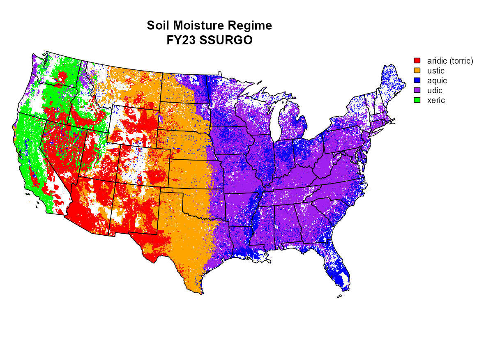
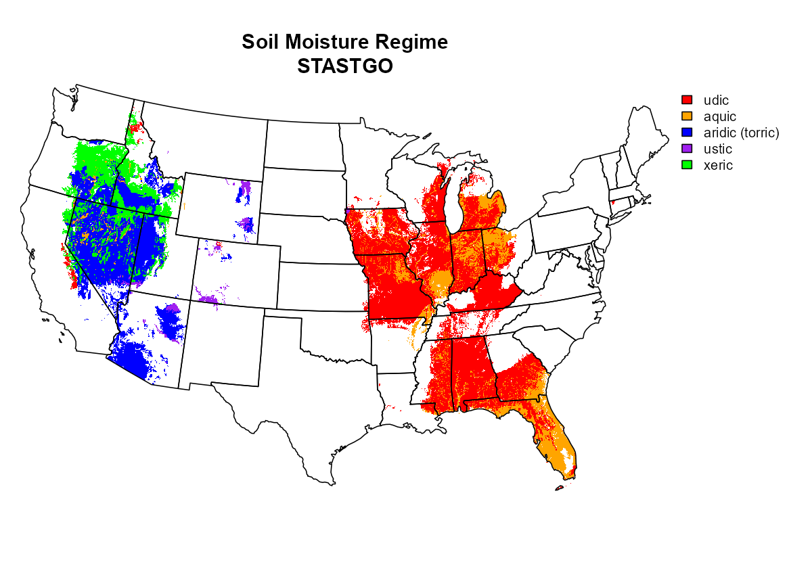
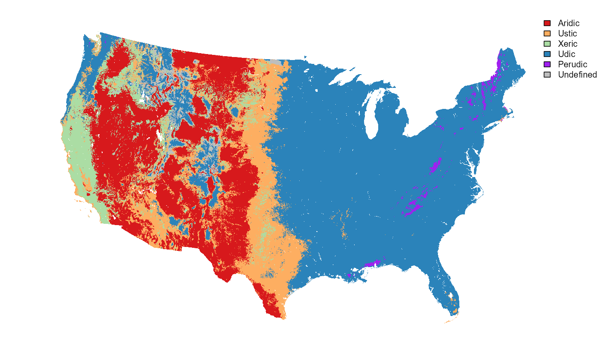

# smr-eval
Evaluation of soil moisture regime concepts, component data population, and more.

## SSURGO|STATSGO Data Population
There are several possible sources of error in these data:

  1. obsolete taxa and empty fields related to SMR
  2. current, or nearly current taxa and empty fields (data population error)
  3. errors in the SMR fields (typo)
  4. SMR class populated in the SMR subclass
  5. ???

Still many missing values, tracking those down...

Note different color scheme.

### SMR Extraction by Formative Element

## Newhall Simulation

## SCAN/SNOTEL

